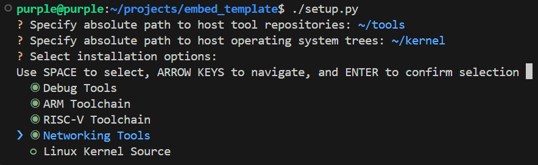
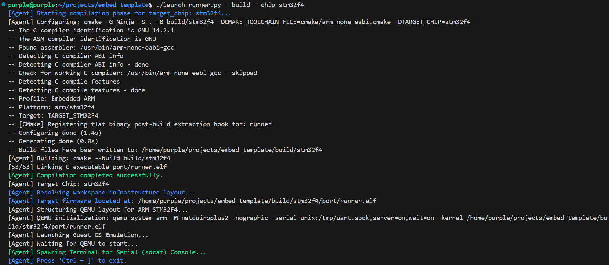
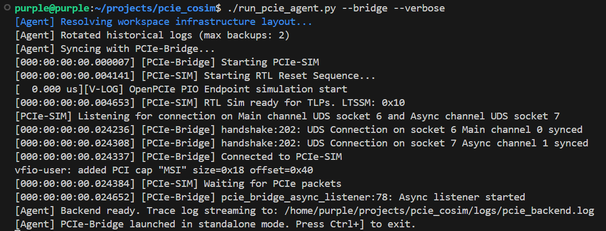
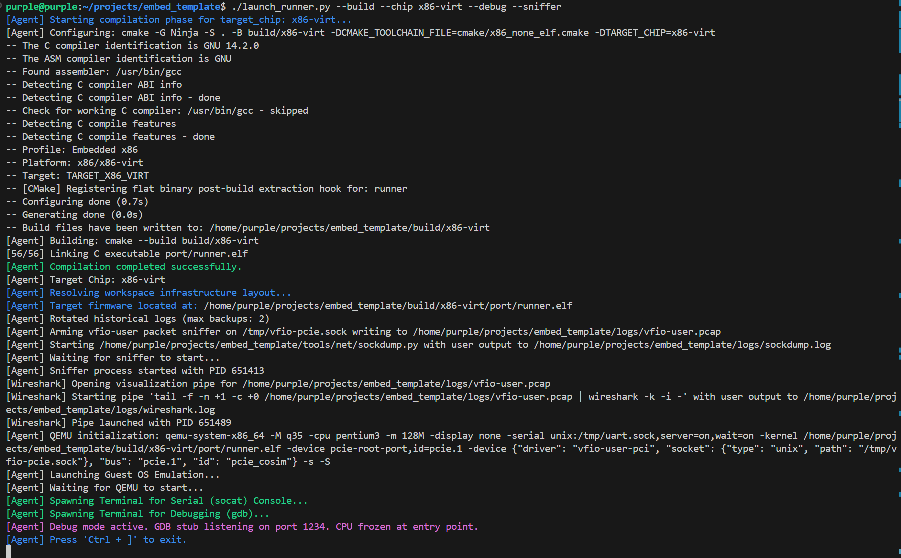
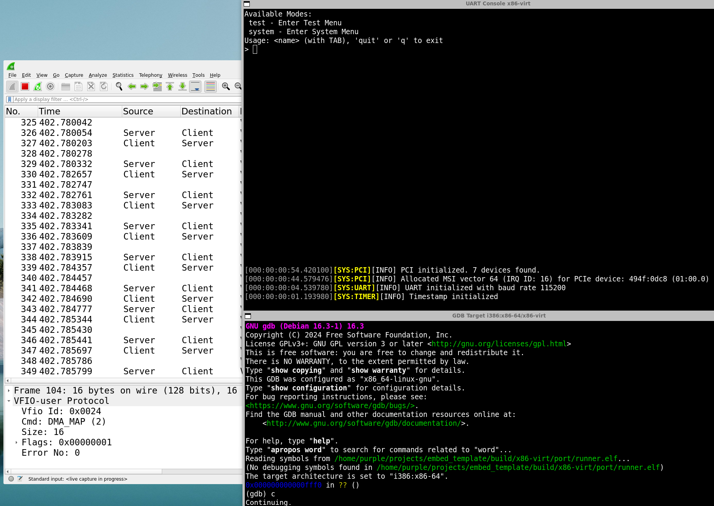
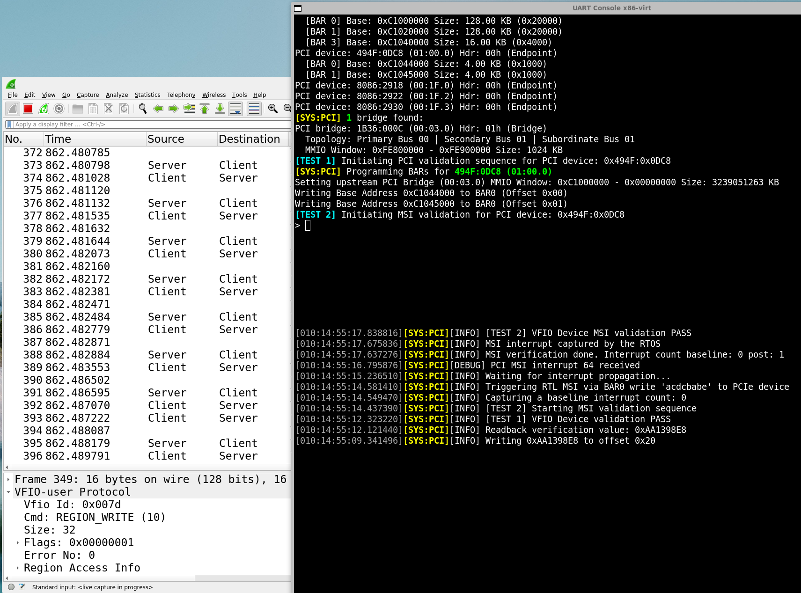

# EmbedTemplate

A modular C/C++ SDK and project template for SoC FW development and HW testing. Featuring a FreeRTOS-based thermal simulation, test framework, CLI, and automated SoC register header generation.

## Project Architecture

- **`common/`**: Platform-independent core logic, logging, and CLI system.
- **`hw/rdl/`**: Place your SystemRDL files here.
- **`src/drivers/`**: Hardware abstraction layer. Register C headers are auto-generated from RDL files.
- **`port/`**: Porting layer for OS or hardware platforms.
- **`third_party/`**:
    - `os/freertos`: FreeRTOS-Kernel (Submodule).
    - `bsp/tf-a`: ARM Trusted Firmware-A (Submodule).
    - `lib/embedded-cli`: Reworked Interactive CLI (Subtree).
        [funbiscuit's embedded-cli](https://github.com/funbiscuit/embedded-cli)
- **`tools/`**:
    - `peakrdl`: Customized PeakRDL-cheader generator (Submodule/Fork).

## Quick Start

### 1. Prerequisites

 - **Python**: `python3`

#### 1.1. Workspace setup

Execute the interactive `setup` script from the root directory to initialize your workspace environment:

```text
    chmod +x /path/to/your/local/EmbedTemplate/setup.py
    ../EmbedTemplate/setup.py
```
For a complete first-time environment installation, use the menu interface to select `Debug Tools`, `ARM Toolchain`, `RISC-V Toolchain`, and `Networking Tools`:



This installs QEMU, Verilator and libvfio-user.

#### 1.2. Optional Renode HW Simulator
To install the `Renode HW Simulator`, download the appropriate package for your host from `https://builds.renode.io/`. For Ubuntu/Debian, you can download and install the latest stable release using:
```text
   wget https://builds.renode.io/renode_1.16.1_amd64.deb
   sudo apt install -y mono-complete libgtk2.0-0 libgtk-3-0
   sudo apt install ./renode_1.16.1_amd64.deb
```
### 2. Initialization

If you just cloned this repository, initialize the submodules:

 ~~~bash
    git submodule update --init --recursive
 ~~~

and for code development, install the pre-commit hook:

 ~~~bash
    pre-commit install
 ~~~

### 3. Build and Run

Execute the `launch_runner` automation script to compile and launch your target chip firmware inside the QEMU:

```text
chmod +x /path/to/your/local/EmbedTemplate/launch_runner.py
./launch_runner.py -h
usage: launch_runner.py [-h] [--build] [--opt OPT] [--verbose] [--chip {stm32f4,gd32vf103,gd32vf103-virt,cortex-a9-virt,x86-virt,x86_64}] [--debug] [--sniffer]
Simulation Framework Agent
options:
  -h, --help            show this help message and exit
  --build               Build target chip firmware before launch. Select --chip to build its firmware.
  --opt OPT             Build options for target chip firmware. Example: --opt="-DENABLE_PCI=True"
  --verbose             Enable verbose build output
  --chip {stm32f4,gd32vf103,gd32vf103-virt,cortex-a9-virt,x86-virt,x86_64}
                        Specify the target chip (default: stm32f4)
  --debug               Enable GDB server on port 1234 and stop guest CPU at startup
  --sniffer             Launch packet sniffer to capture QEMU vfio-user traffic
```

To build and launch standard target firmware (e.g., STM32F4), run:
 - **Target: Embedded ARM (STM32F4)**:
```text
    ../EmbedTemplate/launch_runner.py --build --chip stm32f4
```


### 3.1. Co-Simulation Build (x86-virt)

 - **Target: Embedded x86 (X86_VIRT)**:
By default, the `x86-virt` target requires an active `PCIe Co-Simulation Bridge` connection. Alternatively, you can build with --opt="-DENABLE_PCI=False". You must launch the PCIe agent in a separate terminal window **prior** to launching `x86-virt`:
```text
    # Terminal 1: Initialize the PCIe Co-Simulation Agent
    ../PcieCosim/run_pcie_agent.py --bridge --verbose
```


```text
    # Terminal 2: Build and launch the x86-virt target with vfio-user packet sniffing and GDB debugger
    ../EmbedTemplate/launch_runner.py --build --chip x86-virt --debug --sniffer
```




### 3.2. Renode Run

If you are using the Renode HW Simulator, open a terminal and run the following command to launch Renode:

 - **Target: Embedded ARM (STM32F4)**:
```text
   renode port/arm/stm32f4/run.resc
```
 - **Target: Embedded RISC-V (GD32VF103)**:
```text
   renode port/riscv/gd32vf103/run.resc
```
Open a separate terminal and run the following command to access the serial console:
```text
   socat -,rawer tcp:localhost:2222
```
## Modular SDK Framework

### Bare-metal C Lib
- **TF-A C lib Port**: Integrated a lightweight, bare-metal optimized subset of the **ARM Trusted Firmware-A** (TF-A) standard C library for use across all components, including the FreeRTOS kernel. This port provides architecture-agnostic implementations of core APIs ensuring minimal binary footprint.

### Interactive CLI
- **Reworked Embedded-CLI**: A low-overhead interface for live system interaction, optimized for deterministic performance and memory efficiency.
#### Key Enhancements
- **O(1) Hashed Lookups**: Replaces linear string searches with a **Look-Aside Buffer** (Shadow Index Map) segmented bitmap, maintaining a 50% load factor for instant command and argument resolution.
- **Tiered, Context-Aware Autocomplete**: Supports dynamic discovery prioritizing active application contexts.
- **Zero-Copy Circular History**: Implements a ring buffer for command history, utilizing backward traversal and sequential duplicate suppression to eliminate `memmove` overhead.
- **Static Allocation**: Zero-heap design ensuring reliability for bare-metal or RTOS environments.

[**CLI Guide**](./common/src/cli/README.md)

### Diagnostic Logger
- **In-Memory & Serial Logging**: Structured logging for real-time firmware diagnostics and post-mortem analysis. The logger implementation is lock-free, multi-writer, and interrupt-safe.
- **Portability**: Shared infrastructure used across both drivers and system-level code.

### Device Drivers
- **ASIC-Driven**: Register headers could be auto-synced from `hw/rdl/` via PeakRDL.

### SoC Test Framework (Testhub)
- **Modular Architecture**: Features decoupled test registries for Device Tests (Drivers) and System Tests (Logic), enabling seamless code sharing and per-IP block development.
- **Automated Integration**: Traditional frameworks often suffer from CI contention when merging large, centralized test suites. This framework resolves that by automating test integration; once a test set is registered, it is automatically included in the execution chain, reducing merge conflicts and manual overhead.

## Diagnostic Logging Matrix
The SDK uses a structured logging system organized into **Domains**, **Entities**, and **Levels**. This allows for granular control over system-wide visibility.

- **Domains**: `DEV` (Hardware/Drivers), `SYS` (Core Logic), `TEST` (Framework).
- **Entities**: `SIM`, `CLI`, `LOG` (System) and `GPIO`, `SYSCTRL`, `TIMER`, `UART` (Hardware/Drivers).
- **Levels**: `NONE`, `CRITICAL`, `ERROR`, `WARN`, `INFO`, `DEBUG`.

### Customization & Extensibility
The provided `DEV` entities (GPIO, UART, etc.) are included as a **functional demonstration** (GPIO) and **placeholders**.
- **Modular Design**: Users should expand these entities to match their specific SoC hardware.
- **Runtime Control**: Query the current matrix via the CLI:
  - `show domains` / `show entities` / `show levels`
  - `show config log` (View current active settings)
  - `set log <domain> <entity> <level>` (Change verbosity on-the-fly)

### FreeRTOS-based Thermal Simulation
This project implements a **Process, Voltage, and Temperature (PVT)** thermal simulation. It models the high-temperature reliability testing used to qualify semiconductors for extreme environments or to accelerate aging for High-Temperature Operating Life (HTOL) estimates.

The simulation demonstrates GPIO-driven actuation of off-chip components. It manages external power for heating and high-RPM cooling fans (Fan 1 and Fan 2) through a standardized digital interface.

The simulation is Zero-Heap Architecture for deterministic performance in embedded environments.

1. **Launch Simulation**: Type `start`
2. **Monitor**: Watch `[SYS:SIM]` logs for real-time temperature telemetry, state changes, and Alarm triggers.
3. **Filter**: Use `set log sys sim none` to silence simulation telemetry while running a driver test.
